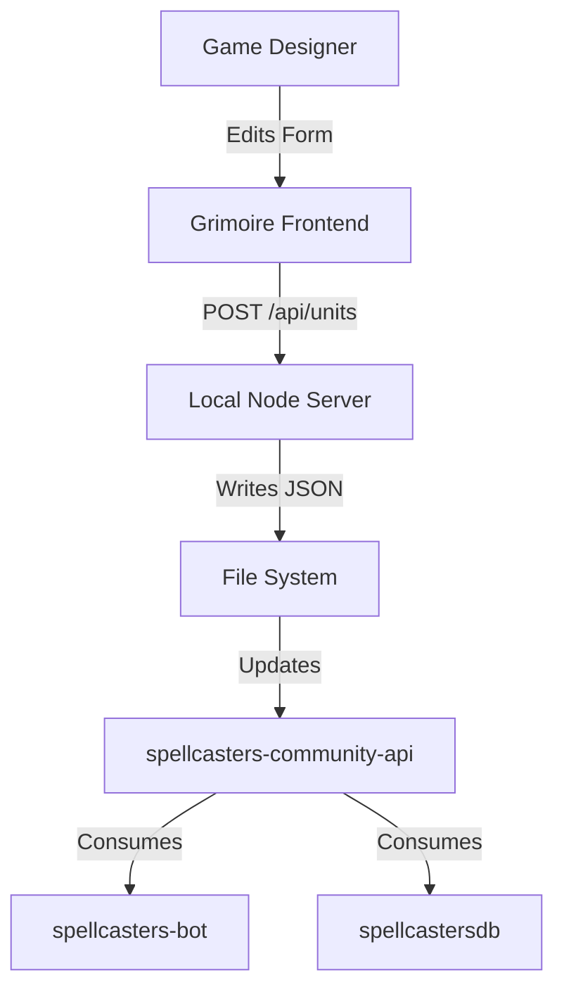

# Design Document: "The Grimoire" (Spellcasters Data Manager)

> **Status:** Scaffolding
> **Author:** Antigravity (AI Assistant)
> **Date:** 2026-02-13

## 1. Overview

"The Grimoire" is a proposed local data management dashboard for _Spellcasters Chronicles_. It serves as the primary interface for game designers and contributors to edit the JSON data stored in the `spellcasters-community-api` repository.

**Key Objectives:**

- **Eliminate manual JSON editing errors:** Replace raw text editing with validated forms.
- **Streamline Asset Management:** Drag-and-drop support for card art and icons.
- **Automate Patch Notes:** Generate changelogs by comparing data snapshots or Git diffs.

## 2. Architecture

### 2.1 Technology Stack (Hybrid Local)

We propose a "Hybrid Local" architecture to balance ease of development with file system access.

- **Frontend:** React (Vite) + Tailwind CSS (shadcn/ui for components).
- **Backend/Middle:** A lightweight Node.js (Express) server running locally.
- **Data Source:** Direct file system access to `../spellcasters-community-api/data`.

### 2.2 Why not just a pure Web App?

Browser sandbox security prevents direct writing to `C:\Projects\...`. A small local server bridges this gap, exposing endpoints like:

- `GET /api/units` -> Reads `units/` directory.
- `POST /api/units` -> Writes JSON file + Validates Schema.
- `POST /api/assets` -> Moves uploaded image to `assets/` folder.

## 3. Core Features

### 3.1 The Editor (The Forge)

A form-based editor for:

- **Units**: Stats, Abilities (with structured inputs for damage/range), Tribes.
- **Spells**: Costs, Effects, Schools.
- **Titans**: unique logic.

**Validation:**
Real-time Zod schema validation ensuring no "illegal" states (e.g., negative mana cost) are saved.

### 3.2 Asset Manager

- **Visual Grid**: See all card art in one place.
- **Drag & Drop**: Drop an image onto a Unit form --> Auto-renames to `unit_{id}.png` --> Saves to correct folder.

### 3.3 Patch Note Generator (The Scribe)

This is the "Killer Feature" for workflow efficiency.

**Workflow:**

1.  **Session Tracking**: The app tracks changes made during the current editing session.
2.  **Git Integration**: The app runs `git diff` behind the scenes.
3.  **Semantic Analysis**:
    - Raw Diff: `damage: 20 -> 25`
    - Generated Note: "**Fireball**: Damage increased from 20 to 25."
4.  **Export**: One-click copy metadata to Clipboard (Markdown format for Discord/GitHub).

## 4. Data Flow

## 5. Security & Deployment

- **Authentication**: None required (Localhost only). The app binds to `127.0.0.1`.
- **Distribution**:
  - **Phase 1**: Run via `npm start`.
  - **Phase 2**: Package as Electron app (`.exe`) for non-technical contributors.

## 6. Future Roadmap

- **Simulation**: Run battle simulations using the data _before_ committing.
- **Remote Sync**: Push changes to GitHub directly from the app.
